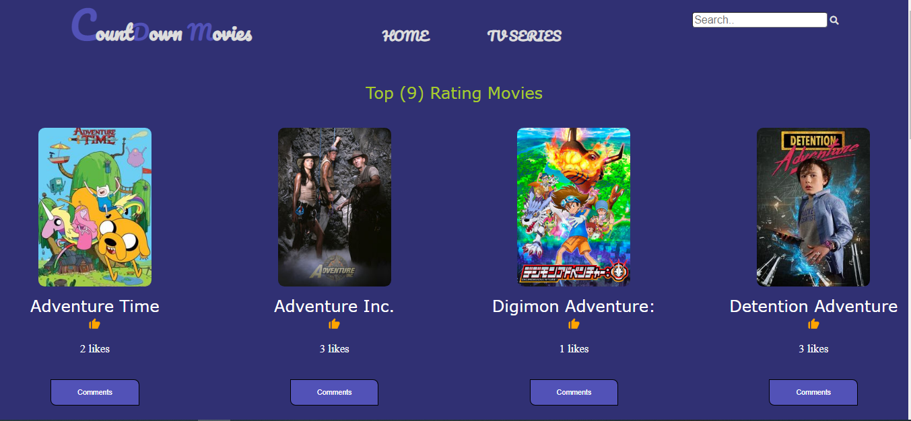

# CountDown Movies

> This is our first pair-programming project in Module 2.

## Built With

- HTML
- CSS
- Javascript
- Webpack


## Screenshot



## Live Demo 🔗

Visit live demo [here]() 👈 to view

## Live Presentation 

Click [here]() to see live presentaion

## Getting Started

To get a local copy up and running follow these simple example steps.

### Setup

```
git clone git@github.com:braincee/JavaScript-Group-Capstone.git
cd JavaScript-Group-Capstone
```

- Open a index.html file with your code editor of your choice and/or a browser of your choice.

```
Open the project using a live saver extension that can be found into your code editor or by using your browser
```

- install project dependencies

```
npm install
```

- build project

```
npm run build
```

- start project

```
npm start
```

- You can also check out this API documentation [link]()

### Environment Prerequisites

Web Browser

Code editor: VsCode or any code editor of your choice

## Authors

👤 **Nii Amanor Djoleto**

- GitHub: [@ramrod433](https://github.com/ramrod433)
- Twitter: [@\_Djoleto](https://twitter.com/_djoleto_)
- LinkedIn: [Nii Amanor Djoleto](https://linkedin.com/in/nii-amanor-djoleto-072b8a14a)

👤 **Stephen Annor**

- GitHub: [@braincee](https://github.com/braincee)
- Twitter: [@annor0543](https://twitter.com/annor0543)
- LinkedIn: [Stephen Annor](https://www.linkedin.com/in/kwesi-appiah-1387801a1/)

## 🤝 Contributing

Contributions, issues, and feature requests are welcome!

## Show your support

Give a ⭐️ if you like this project!

## Acknowledgments

- Hat tip to anyone whose code was used
- Inspiration
- etc

## 📝 License

This project is [MIT](./MIT.md) licensed.
